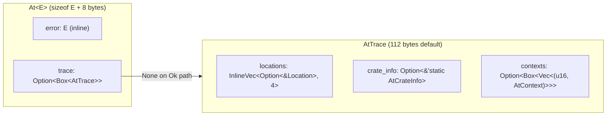

# Advanced Usage

Most users only need `At<E>`, `at!()`, `.at()`, and `.map_err_at()` — see the [README](README.md). This document covers everything else: embedding traces in your own error types, tuning allocation behavior, workspace layouts, output formatting, and link customization.

- [Internal Data Structure](#internal-data-structure) — how `At<E>` and `AtTrace` are laid out in memory
- [Embedded Traces (AtTraceable)](#embedded-traces-attraceable) — store the trace inside your error type
- [Complex Workspace Layouts](#complex-workspace-layouts) — monorepos and runtime path detection
- [Link Formats](#link-formats) — GitHub, GitLab, Gitea, Bitbucket, custom
- [Allocation Behavior](#allocation-behavior) — inline storage features, OOM handling
- [Pretty Output Formatters](#pretty-output-formatters) — terminal colors, HTML
- [Benchmarks](#benchmarks) — detailed numbers

## Internal Data Structure



Locations are stored oldest-first in an inline vector (4 slots before heap spill). Each location is an `Option<&'static Location>` — `None` marks a skipped-frames placeholder (`[...]`).

Contexts are stored separately in a `Vec<(u16, AtContext)>` where the `u16` is the index into the locations array. This means:
- Adding a location (`.at()`) is just a push — no context allocation needed
- Adding context (`.at_str()`) lazily allocates the context vec on first use
- Multiple contexts can point to the same location index
- The context vec is `Option<Box<Vec<...>>>` — 8 bytes when empty, no allocation until first context

```
locations:  [ loc0,   loc1,   loc2,   None  ]
               │        │       │       └─ skipped frames marker
               │        │       └─ src/handler.rs:42:5
               │        └─ src/db.rs:89:9
               └─ src/db.rs:15:13 (origin)

contexts:   [ (2, Text("processing request")),
              (2, Data(request_id: 7)),
              (1, Text("user lookup failed")) ]
              │    └─ points to locations[2]
              └─ index into locations array
```

This design keeps the common case (locations only, no context) allocation-free beyond the initial `Box<AtTrace>`.

## Embedded Traces (AtTraceable)

For full control over error layout, embed `AtTrace` directly in your error type instead of using `At<E>`.

```rust
use whereat::{AtTrace, AtTraceable, ResultAtTraceableExt};

struct MyError {
    kind: ErrorKind,
    trace: AtTrace,
}

impl AtTraceable for MyError {
    fn trace_mut(&mut self) -> &mut AtTrace { &mut self.trace }
    fn trace(&self) -> Option<&AtTrace> { Some(&self.trace) }
    fn fmt_message(&self, f: &mut std::fmt::Formatter<'_>) -> std::fmt::Result {
        write!(f, "{:?}", self.kind)
    }
}

impl MyError {
    #[track_caller]
    fn new(kind: ErrorKind) -> Self {
        Self { kind, trace: AtTrace::capture() }
    }
}

// Now use ResultAtTraceableExt instead of ResultAtExt
fn caller() -> Result<(), MyError> {
    inner().at_str("context")?;
    Ok(())
}
```

### Storage Options

Choose trace storage based on your error type's size constraints:

| Field Type | Size | Behavior |
|------------|------|----------|
| `AtTrace` | 40 bytes | Trace always captured at construction |
| `Box<AtTrace>` | 8 bytes | Smaller error, trace always heap-allocated |
| `Option<Box<AtTrace>>` | 8 bytes | Lazy allocation on first `.at_*()` call |

For lazy allocation, implement `trace_mut` with lazy init:

```rust
struct MyError {
    kind: ErrorKind,
    trace: Option<Box<AtTrace>>,
}

impl AtTraceable for MyError {
    fn trace_mut(&mut self) -> &mut AtTrace {
        self.trace.get_or_insert_with(|| Box::new(AtTrace::new()))
    }
    fn trace(&self) -> Option<&AtTrace> { self.trace.as_deref() }
    // ...
}
```

### Converting Between At<E> and AtTraceable

```rust
// At<A> → At<B>: map_error() preserves trace
let b: At<KindB> = a.map_error(|kind| convert(kind));

// At<A> → CustomError: into_traceable() transfers trace
let custom: CustomError = at_err.into_traceable(|kind| CustomError::from(kind));

// CustomError → At<B>: into_at() transfers trace
let at_b: At<KindB> = custom.into_at(|e| convert(e.kind));
```

## Complex Workspace Layouts

### When Workspace Root != Git Root

If your crate lives in a subdirectory of a larger repository:

```
my-monorepo/           ← git root
├── .git/
├── services/
│   └── api/
│       └── crates/
│           └── mylib/  ← your crate here
│               ├── Cargo.toml
│               └── src/
```

Configure the path from git root to your crate:

```rust
whereat::define_at_crate_info!(
    path = "services/api/crates/mylib/",
);
```

### Runtime Path Detection

For dynamic environments (monorepos with varying layouts), compute the path at init time:

```rust
use std::sync::OnceLock;
use whereat::AtCrateInfo;

static CRATE_INFO: OnceLock<AtCrateInfo> = OnceLock::new();

pub(crate) fn at_crate_info() -> &'static AtCrateInfo {
    CRATE_INFO.get_or_init(|| {
        // Compute path based on environment
        let path = std::env::var("CRATE_PATH_IN_REPO")
            .unwrap_or_else(|_| "crates/mylib/".into());

        AtCrateInfo::builder()
            .name(env!("CARGO_PKG_NAME"))
            .repo(option_env!("CARGO_PKG_REPOSITORY"))
            .commit(option_env!("GIT_COMMIT"))
            .path_owned(Some(path))
            .build()
    })
}
```

The `_owned()` builder methods leak strings via `Box::leak` for `'static` lifetime.

## Link Formats

### Supported Forges

| Forge | Format Constant | Example Link |
|-------|----------------|--------------|
| GitHub | `GITHUB_LINK_FORMAT` | `repo/blob/commit/path/file#L42` |
| GitLab | `GITLAB_LINK_FORMAT` | `repo/-/blob/commit/path/file#L42` |
| Gitea/Forgejo | `GITEA_LINK_FORMAT` | `repo/src/commit/commit/path/file#L42` |
| Bitbucket | `BITBUCKET_LINK_FORMAT` | `repo/src/commit/path/file#lines-42` |

### Manual Selection

```rust
use whereat::{AtCrateInfo, GITLAB_LINK_FORMAT};

static INFO: AtCrateInfo = AtCrateInfo::builder()
    .name("mylib")
    .repo(Some("https://gitlab.com/org/repo"))
    .link_format(GITLAB_LINK_FORMAT)
    .build();
```

### Auto-Detection

```rust
let info = AtCrateInfo::builder()
    .name("mylib")
    .repo(Some("https://gitlab.com/org/repo"))
    .link_format_auto()  // Detects GitLab from URL
    .build();
```

### Custom Format

```rust
// Format placeholders: {repo}, {commit}, {path}, {file}, {line}
const MY_FORMAT: &str = "{repo}/browse/{path}{file}?at={commit}#L{line}";

static INFO: AtCrateInfo = AtCrateInfo::builder()
    .link_format(MY_FORMAT)
    .build();
```

## Allocation Behavior

### Default (Heap)

By default, traces use 4 inline location slots plus heap overflow. Each `.at()` call may allocate if the inline capacity is exceeded.

### Inline Storage Features

For performance-critical code, enable inline storage to reduce allocations:

| Feature | Inline Slots | sizeof(AtTrace) | Best For |
|---------|--------------|-----------------|----------|
| `_tinyvec-64-bytes` | 4 | ≤64 bytes | Very shallow traces |
| `_tinyvec-128-bytes` | 12 | ≤128 bytes | Typical traces |
| `_tinyvec-256-bytes` | 28 | ≤256 bytes | Deep traces |
| `_tinyvec-512-bytes` | 60 | ≤512 bytes | Very deep traces |
| `_smallvec-128-bytes` | 12 | ≤128 bytes | Best Linux perf |
| `_smallvec-256-bytes` | 28 | ≤256 bytes | Best Windows perf for deep traces |

```toml
[dependencies]
whereat = { version = "0.1", features = ["_tinyvec-128-bytes"] }
```

**Recommendations:**
- Linux: `_smallvec-128-bytes` for all frame counts
- Windows: `_smallvec-128-bytes` for ≤12 frames, `_smallvec-256-bytes` for >12
- Cross-platform default: `_tinyvec-128-bytes`

### OOM Handling

- `Vec` and `String` operations use `try_reserve` — silently skip on OOM
- `Box` allocations use `Box::new` — can panic (waiting for `Box::try_new` stabilization)
- The error `E` is always stored inline in `At<E>`, so errors propagate even if tracing fails

## Pretty Output Formatters

whereat includes optional formatters for terminal colors and HTML output.

### Terminal Colors (`_termcolor` feature)

```toml
[dependencies]
whereat = { version = "0.1", features = ["_termcolor"] }
```

```rust
use whereat::{at, At};

#[derive(Debug)]
struct MyError;

let err: At<MyError> = at(MyError).at_str("loading config");

// Colored output (uses owo-colors)
println!("{}", err.display_color());

// Colored output with GitHub/GitLab links
println!("{}", err.display_color_meta());
```

Output uses ANSI colors:
- Error type in **red**
- File paths in **cyan**
- Line numbers in **yellow**
- Context strings in **dimmed**

### HTML Output (`_html` feature)

```toml
[dependencies]
whereat = { version = "0.1", features = ["_html"] }
```

```rust
// Basic HTML (no styles, use your own CSS)
println!("{}", err.display_html());

// HTML with embedded <style> block
println!("{}", err.display_html_styled());
```

Example styled HTML output:

```html
<div class="whereat-error">
<div class="error-header">Error: MyError</div>
<div class="location"><span class="at-prefix">at </span><span class="file">src/main.rs</span><span class="at-prefix">:</span><span class="line">42</span></div>
<div class="context">╰─ <span class="context-text">loading config</span></div>
</div>
```

### Running the Example

```bash
cargo run --example pretty_output --features "_termcolor,_html"
```

## Benchmarks

See [docs/BENCHMARK.md](docs/BENCHMARK.md) for detailed performance comparisons.

Quick summary:
- whereat is **150x faster** than `backtrace` crate at same frame depth
- whereat is **25-40x faster** than panic+catch_unwind
- `At<E>` wrapper has zero overhead when no frames are captured
- Per-frame cost: ~16ns (Copy types), ~25ns (heap types)
