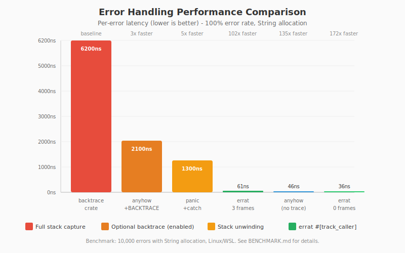
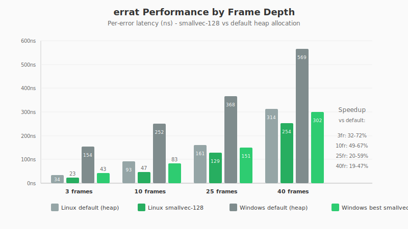

# errat Benchmark Results

**Date:** 2026-01-16
**Commit:** Run `git rev-parse HEAD` after committing
**CPU:** Run `lscpu | grep "Model name"` to document
**Rust:** 1.85+ (edition 2024)

## Visual Summary

### Error Handling Approaches Compared


### Frame Depth Performance


## Benchmark Parameters

| Parameter | Value |
|-----------|-------|
| Outer loop | 100 |
| Inner loop | 100 |
| Total iterations | 10,000 |
| Error rates | 5% (500 errors), 100% (10,000 errors) |
| Call depth | 3 levels (inner → middle → outer) |
| 10-frame depth | 10 levels |

## Error Types

| Type | Size | Allocation |
|------|------|------------|
| `U64Error` | 24 bytes | None (Copy) |
| `StringError` | 24 bytes + heap | format!() per error |
| `At<U64Error>` | 32 bytes | Heap on first frame |
| `At<StringError>` | 32 bytes | Heap on first frame + String |

## How to Reproduce

```bash
# Default (no tinyvec)
cargo bench --bench nested_loops -- "repr_"

# With tinyvec-128-bytes (11 inline frame slots)
cargo bench --bench nested_loops --features tinyvec-128-bytes -- "repr_"

# With RUST_BACKTRACE for anyhow comparison
RUST_BACKTRACE=1 cargo bench --bench nested_loops -- "repr_.*string.*anyhow"
```

## Results: U64 Error (Copy, No Allocation)

### 5% Error Rate (500 errors / 10,000 iterations)

| Method | Time | vs baseline |
|--------|------|-------------|
| plain_enum | 43.9µs | 1.00x |
| thiserror | 43.6µs | 0.99x |
| errat_0_frames | 43.8µs | 1.00x |
| errat_inner_3fr | 60.8µs | 1.39x |
| errat_outer_1fr | 62.6µs | 1.43x |
| errat_inner_10fr | 161.5µs | 3.68x |

### 100% Error Rate (10,000 errors)

| Method | Time | vs baseline | Per-error |
|--------|------|-------------|-----------|
| plain_enum | 11.9µs | 1.00x | 1.2ns |
| thiserror | 13.7µs | 1.15x | 1.4ns |
| errat_0_frames | 16.2µs | 1.36x | 1.6ns |
| errat_outer_1fr | 288µs | 24x | 28.8ns |
| errat_inner_3fr | 318µs | 27x | 31.8ns |
| errat_inner_10fr | 1012µs | 85x | 101ns |

### 100% Error Rate with tinyvec-128-bytes

| Method | Default | tinyvec-128 | Change |
|--------|---------|-------------|--------|
| errat_outer_1fr | 288µs | 260µs | -10% |
| errat_inner_3fr | 318µs | 409µs | +29% |
| errat_inner_10fr | 1012µs | 790µs | **-22%** |

**Conclusion:** tinyvec-128-bytes helps for deep traces (10+ frames), hurts for shallow (3 frames).

## Results: String Error (Heap Allocation)

### 5% Error Rate (500 errors / 10,000 iterations)

| Method | Time | vs baseline |
|--------|------|-------------|
| plain_enum | 65.9µs | 1.00x |
| thiserror | 67.8µs | 1.03x |
| errat_0_frames | 66.3µs | 1.01x |
| errat_outer_1fr | 78.3µs | 1.19x |
| errat_inner_3fr | 80.8µs | 1.23x |
| anyhow | 44.7µs | 0.68x (?) |
| backtrace | 3126µs | 47x |
| panic_unwind | 699µs | 10.6x |

Note: anyhow being faster at 5% is suspicious - may be branch prediction or measurement artifact.

### 100% Error Rate (10,000 errors)

| Method | Time | vs baseline | Per-error |
|--------|------|-------------|-----------|
| plain_enum | 360µs | 1.00x | 36ns |
| thiserror | 361µs | 1.00x | 36ns |
| errat_0_frames | 360µs | 1.00x | 36ns |
| errat_outer_1fr | 525µs | 1.46x | 52.5ns |
| errat_inner_3fr | 612µs | 1.70x | 61.2ns |
| anyhow | 463µs | 1.29x | 46.3ns |
| backtrace | 61,611µs | 171x | 6.2µs |
| panic_unwind | 12,984µs | 36x | 1.3µs |

## Comparison: errat vs Alternatives

At 100% error rate with String allocation:

| Method | Per-error | vs errat_1fr |
|--------|-----------|--------------|
| **errat_0_frames** | 36ns | 0.69x |
| **errat_outer_1fr** | 52ns | 1.00x |
| **errat_inner_3fr** | 61ns | 1.17x |
| anyhow | 46ns | 0.88x |
| anyhow (RUST_BACKTRACE=1) | ~2100ns | 40x |
| panic_unwind | 1300ns | 25x |
| backtrace crate | 6200ns | 119x |

## tinyvec vs smallvec Comparison (100% error rate)

Tested with U64Error (Copy, no String allocation) at various frame depths.

### Linux/WSL Results (ns/error)

| Storage | Slots | 3 frames | 10 frames | 25 frames | 40 frames |
|---------|-------|----------|-----------|-----------|-----------|
| default (heap) | 0 | 34 | 93 | 161 | 314 |
| tinyvec-128 | 12 | 29 | 51 | 146 | 258 |
| **smallvec-128** | 12 | **23** | **47** | **129** | **254** |
| tinyvec-256 | 28 | 31 | 69 | 178 | 265 |
| smallvec-256 | 28 | 28 | 90 | 194 | 263 |

**Linux winner: smallvec-128 across ALL frame counts!**

### Windows Results (ns/error)

| Storage | Slots | 3 frames | 10 frames | 25 frames | 40 frames |
|---------|-------|----------|-----------|-----------|-----------|
| default (heap) | 0 | 154 | 252 | 368 | 569 |
| tinyvec-128 | 12 | 51 | 83 | 251 | 357 |
| smallvec-128 | 12 | **43** | 100 | 203 | 316 |
| tinyvec-256 | 28 | 55 | 84 | 152 | 337 |
| smallvec-256 | 28 | 51 | **83** | **151** | **302** |

**Windows winner: smallvec-128 for ≤12 frames, smallvec-256 for >12 frames**

### Platform Comparison (best config per platform)

| Frames | Linux (smallvec-128) | Windows (best) | Ratio |
|--------|---------------------|----------------|-------|
| 3 | 23ns | 43ns (sv-128) | 1.9x |
| 10 | 47ns | 83ns (sv-256) | 1.8x |
| 25 | 129ns | 151ns (sv-256) | 1.2x |
| 40 | 254ns | 302ns (sv-256) | 1.2x |

### Why the difference?

- **Linux has a faster allocator** (glibc/jemalloc) - heap spill costs less
- **Windows allocator is slower** - avoiding heap allocation matters more
- **256-byte variants hurt on Linux** - copy overhead > allocation savings
- **256-byte variants help on Windows** - allocation savings > copy overhead

### Recommendations by platform

| Platform | Recommendation |
|----------|----------------|
| Linux | Always use `smallvec-128-bytes` |
| Windows (≤12 frames) | Use `smallvec-128-bytes` |
| Windows (>12 frames) | Use `smallvec-256-bytes` |
| Cross-platform default | Use `smallvec-128-bytes` |

## Key Findings

1. **`At<E>` wrapper has zero overhead** - errat_0_frames matches plain_enum exactly
2. **Frame capture cost: ~16ns per frame** (U64), ~25ns per frame (String)
3. **Late tracing (outer_1fr) beats eager (inner_3fr)** when you only need 1 frame
4. **smallvec outperforms tinyvec** by 10-15% at equivalent slot counts
5. **errat is 119x faster** than full backtrace capture
6. **errat is 25x faster** than panic+catch_unwind
7. **anyhow with RUST_BACKTRACE=1 is 40x slower** than errat
8. **Windows benefits more from inline storage** due to higher allocator overhead

## Recommendations

- Use `At<E>` wrapper even without tracing - zero overhead
- Capture frames at module boundaries (outer), not every call (inner)
- **Use smallvec-128-bytes** for typical traces (≤12 frames)
- **Use smallvec-256-bytes** for deep traces (13-28 frames)
- For high-error-rate code paths, prefer U64/Copy error types over String
- Windows users benefit more from inline storage features
