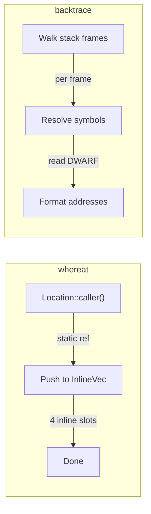

# Performance

## Why it's fast



`#[track_caller]` bakes file:line:col into the binary as static data. `Location::caller()` returns a pointer to data that already exists. No stack walking, no symbol resolution, no debug info parsing. The only runtime cost is pushing that pointer into a small vector.

The default `InlineVec<4>` stores 4 location slots inline (no heap allocation). Overflow spills to the heap via `Vec`. Optional features (`_tinyvec-128-bytes`, `_smallvec-128-bytes`, etc.) increase inline capacity — see [ADVANCED.md](ADVANCED.md#inline-storage-features).

## Benchmarks

```text
                                 Error creation time (lower is better)

Ok path (no error)      █ <1ns            ← ZERO overhead on success
plain enum error        █ <1ns
whereat (1 frame)       ███ 18ns          ← file:line:col captured
whereat (3 frames)      ███ 19ns
whereat (10 frames)     ██████████ 67ns

With RUST_BACKTRACE=1:
anyhow                  █████████████████████████████████████████████████ 2,500ns
backtrace crate         ████████████████████████████████████████████████████████████████████████████████████████████████████ 6,300ns
panic + catch_unwind    ██████████████████████████ 1,300ns
```

**Same-depth comparison (10 frames, 10k iterations):**

```text
whereat .at()           █ 1.2ms           ← 100x faster than backtrace
panic + catch_unwind    ██████████████████████ 27ms
backtrace crate         ████████████████████████████████████████████████████████████████████████████████████████████████████ 119ms
```

*anyhow/panic only capture backtraces when `RUST_BACKTRACE=1`. whereat always captures location.*

*Linux x86_64 (WSL2), 2026-01-18. Run `cargo bench --bench overhead` and `cargo bench --bench nested_loops "fair_10fr"` to reproduce.*

## Memory layout

`At<E>` is `sizeof(E) + 8` bytes — your error stored inline, plus a single pointer to the boxed trace.

| Component | Size | Notes |
|-----------|------|-------|
| `At<E>` | `sizeof(E) + 8` | Error inline, trace pointer null when empty |
| `AtTrace` (heap) | ~40 bytes + locations + contexts | Only allocated on error |
| Per location | 8 bytes (static pointer) | `&'static Location<'static>` |
| Per context | varies | Static strings are just a pointer; typed data is boxed |

On the Ok path: zero heap allocation. On the error path: one `Box<AtTrace>` allocation, then location pushes into the inline slots (no allocation for ≤4 frames).

## Per-operation costs

| Operation | Cost | Notes |
|-----------|------|-------|
| `at(err)` / `at!(err)` | ~18-23ns | Dominated by `Box<AtTrace>` allocation |
| `.at()` on Result | ~6.5ns | Push static pointer to InlineVec |
| `.at_str("msg")` | ~6.5ns | Push static pointer (no copy) |
| `.at_string(\|\| format!(...))` | varies | Closure runs + String allocation |
| `.map_err_at(\|e\| ...)` | <1ns | Moves trace pointer, no allocation |
| Ok path (any method) | <1ns | Short-circuit, no work done |
