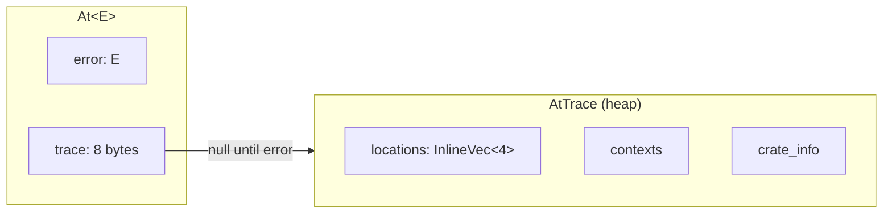
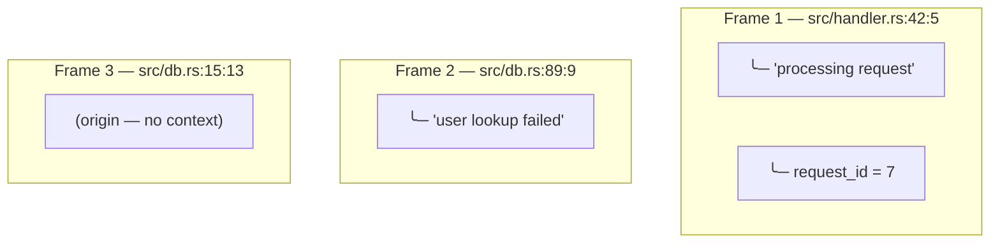

# whereat

[](https://github.com/lilith/whereat/actions/workflows/ci.yml)
[](https://crates.io/crates/whereat)
[](https://docs.rs/whereat)
[](https://codecov.io/gh/lilith/whereat)
[](LICENSE)
[](https://lilith.github.io/whereat/)

Know where the bug is `at()` — **without panic!, debuginfo, or overhead.** Replace `?` with `.at()?` to get build-time, async-friendly stacktraces with clickable GitHub links.

```
Error: UserNotFound
   at src/db.rs:142:9
      ╰─ user_id = 42
   at src/api.rs:89:5
      ╰─ in handle_request
   at myapp @ https://github.com/you/myapp/blob/a1b2c3d/src/main.rs#L23
```

Compatible with plain enums, errors, structs, thiserror, anyhow, or any type with `Debug`. No changes to your error types required!

## Quick Start

`at!()` creates a traced error. `.at()?` propagates it. That's it.

```rust
// once in lib.rs — enables clickable GitHub links in traces
// For workspace crates: whereat::define_at_crate_info!(path = "crates/mylib/");
whereat::define_at_crate_info!();

use whereat::prelude::*;

#[derive(Debug)]
enum DbError { NotFound, ConnectionFailed }

fn get_user(id: u64) -> Result<String, At<DbError>> {
    if id == 0 { return Err(at!(DbError::NotFound)); } // at!() starts the trace
    Ok("alice".into())
}

fn get_email(id: u64) -> Result<String, At<DbError>> {
    let name = get_user(id).at()?; // .at()? adds this call site to the trace
    Ok(format!("{}@example.com", name))
}
```

### Multiple error types

```rust
#[derive(Debug)]
enum ApiError { Db(DbError), BadRequest(String) }

fn handle_request(id: u64) -> Result<String, At<ApiError>> {
    let email = get_email(id)
        .at()                           // new frame at this call site
        .at_str("looking up recipient") // context on that frame
        .map_err_at(ApiError::Db)?;     // DbError → ApiError, trace preserved
    Ok(email)
}

fn api_endpoint(id: u64) -> Result<String, At<ApiError>> {
    let result = handle_request(id).at()?; // propagate with location tracking
    Ok(result)
}
```

See [Avoiding Trace Loss](#avoiding-trace-loss) for patterns that silently destroy traces. Full runnable version: [`examples/readme.rs`](examples/readme.rs).

## How it works

`At<E>` stores your error inline + an 8-byte pointer to a boxed trace. On the happy path, nothing is heap-allocated.



Each `.at()` call is annotated with `#[track_caller]` — the compiler bakes file:line:col into the binary as static data. No runtime stack walking, no debug symbols needed.

### Frames vs contexts

`.at()` creates a **frame** (a new location). `.at_str()` adds **context** to the last frame.



**150x faster than `backtrace`**, zero overhead on the Ok path, ~18ns per frame on error. See [PERFORMANCE.md](PERFORMANCE.md) for benchmarks.

## API Overview

**Starting a trace:**

| Function | Works on | Crate info | Use when |
|----------|----------|------------|----------|
| `at!(err)` | Any type | ✅ GitHub links | Default — requires `define_at_crate_info!()` |
| `at(err)` | Any type | ❌ None | Quick prototyping, no setup |
| `err.start_at()` | `Error` types | ❌ None | Chaining on error values |

**Extending a trace** (on `Result<T, At<E>>`):

| Method | Effect |
|--------|--------|
| `.at()` | **New frame** at caller's location |
| `.at_str("msg")` | Add context to **last frame** (no new location) |
| `.map_err_at(\|e\| ...)` | Convert error type, **preserve trace** |

**Inspecting / decomposing:**

| Method | Effect |
|--------|--------|
| `.error()` | Borrow the inner `&E` |
| `.decompose()` | Consume into `(E, Option<AtTrace>)` — preserves the trace |
| `.map_error(\|e\| ...)` | Convert error type inside `At<E>`, preserving trace |

**Key**: `.at()` creates a NEW frame. `.at_str()` adds to the LAST frame. See [Adding Context](#adding-context) for full list.

## Avoiding Trace Loss

whereat only works if you keep the trace alive as errors propagate. These patterns silently destroy traces — **avoid them**.

### Never use `.into_inner()` during error propagation

`into_inner()` is deprecated since 0.1.4 because it discards the trace. Use `decompose()` to get both error and trace, or `map_error()` / `map_err_at()` to convert types while preserving the trace.

```rust
// WRONG — trace is gone
let bare_err = at_err.into_inner();
return Err(at(MyError::Sub(bare_err)));

// RIGHT — trace preserved
return inner_call().map_err_at(|e| MyError::Sub(e));
```

### Never implement `From<At<X>> for Y`

This gets invoked by `?` and discards the `At<>` wrapper (and its trace):

```rust
// WRONG — ? uses this From impl, trace dies
impl From<At<BufferError>> for TiffError {
    fn from(e: At<BufferError>) -> Self {
        TiffError::Buffer(e.into_inner())  // trace lost!
    }
}

// RIGHT — implement From on the bare types, convert with map_err_at
impl From<BufferError> for TiffError {
    fn from(e: BufferError) -> Self { TiffError::Buffer(e) }
}

fn decode() -> Result<(), At<TiffError>> {
    pixel_call().map_err_at(TiffError::from)?;  // trace preserved
    Ok(())
}
```

### Never format-then-rewrap

Formatting the error into a string and wrapping it in a new `At<>` destroys the original trace:

```rust
// WRONG — inner trace is gone, you only get the adapter's location
.map_err(|e| Error::Other(format!("decode failed: {}", e.into_inner())).at())?;

// RIGHT — convert the error type, keep the trace
.map_err_at(|e| Error::Other(e.to_string()))?;
```

### `#[from]` doesn't work with `At<>` — don't reach for `.into_inner()`

thiserror's `#[from]` generates `From<SubError> for MyError`, but `?` on `Result<T, At<SubError>>` needs `From<At<SubError>> for At<MyError>`, which doesn't exist. The compiler will reject it. The temptation is to "fix" this with `.into_inner()` — **don't**. Use `map_err_at` instead:

```rust
// WON'T COMPILE — no From<At<SubError>> for At<MyError>
sub_call()?;

// WRONG — compiles but trace dies
sub_call().map_err(|e| MyError::Sub(e.into_inner()))?;

// RIGHT — trace preserved
sub_call().map_err_at(|e| MyError::Sub(e))?;
```

### Always trace at error origination

Every `Err(MyError::Variant)` should be `Err(at(MyError::Variant))` or `Err(at!(MyError::Variant))`. If you skip this, there's no trace to propagate.

## `no_std` by Default

whereat is `#![no_std]` with `alloc` — no feature flags needed. `core::error::Error` is stable since Rust 1.81 and whereat requires 1.85+. A `std` feature exists for historical compatibility but is a no-op.

## Best Practices

**Define a Result alias** in every crate that uses whereat:
```rust
pub type Result<T> = core::result::Result<T, At<MyError>>;
```

**Use `map_err_at` at every error type boundary.** This is the trace-preserving equivalent of `map_err`. If you're calling `.map_err()` on a `Result<T, At<E>>`, you probably want `.map_err_at()` instead.

**Use `at()` or `at!()` at every error origination.** An error without a trace is invisible.

**Keep hot loops zero-alloc.** You don't need `At<>` inside hot loops. Defer tracing until you exit. `.at_skipped_frames()` adds a `[...]` marker to indicate frames were skipped.

**Use `at_crate!()` at crate boundaries** when consuming errors from dependencies — ensures backtraces show your crate's GitHub links instead of confusing paths.

## Design Philosophy

**You define your own error types.** whereat doesn't impose any structure on your errors — use enums, structs, or whatever suits your domain. whereat just wraps them in `At<E>` to add location+context+crate tracking.

### Which Approach?

| Situation | Use |
|-----------|-----|
| You have an existing struct/enum you don't want to modify | Wrap with `At<YourError>` |
| You want traces embedded inside your error type | Implement `AtTraceable` trait |

**Wrapper approach** (most common): Return `Result<T, At<YourError>>` from functions. The trace lives outside your error type.

**Embedded approach**: Implement `AtTraceable` on your error type and store an `AtTrace` (or `Box<AtTrace>`) field inside it. Return `Result<T, YourError>` directly. See [ADVANCED.md](ADVANCED.md) for details.

This means you can:
- Use `thiserror` for ergonomic `Display`/`From` impls, or `anyhow`
- Use any enum or struct that implements `Debug`
- Define type aliases like `type Result<T> = core::result::Result<T, At<MyError>>`
- Access your error via `.error()` or deref
- Support nesting with `core::error::Error::source()`

## Features

- **Small sizeof**: `At<E>` is only `sizeof(E) + 8` bytes (one pointer for boxed trace)
- **Zero allocation on Ok path**: No heap allocation until an error occurs
- **Ergonomic API**: `.at()` on Results, `.start_at()` on errors, `.map_err_at()` for trace-preserving conversions
- **Context options**: `.at_str()`, `.at_string()`, `.at_fn()`, `.at_named()`, `.at_data()`, `.at_debug()`, `.at_aside_error()`
- **Cross-crate tracing**: `at!()` and `at_crate!()` macros capture crate info for GitHub/GitLab/Gitea/Bitbucket links
- **Equality/Hashing**: `PartialEq`, `Eq`, `Hash` compare only the error, not the trace
- **no_std compatible**: Works with just `core` + `alloc`

## Adding Context

**Add a new location frame:**
```rust
result.at()?                    // New frame with just file:line:col
result.at_fn(|| {})?            // New frame + captures function name
result.at_named("validation")?  // New frame + custom label
```

**Add context to the last frame** (no new location):
```rust
result.at_str("loading config")?            // Static string (zero-cost)
result.at_string(|| format!("id={}", id))?  // Dynamic string (lazy)
result.at_data(|| path_context)?            // Typed via Display (lazy)
result.at_debug(|| request_info)?           // Typed via Debug (lazy)
result.at_aside_error(io_err)?              // Attach a related error (diagnostic only,
                                            // NOT in the .source() chain)
```

If the trace is empty, context methods create a frame first. Example:

```rust
// One frame with two contexts attached
let e = at!(MyError).at_str("a").at_str("b");
assert_eq!(e.frame_count(), 1);

// Two frames: at!() creates first, .at() creates second
let e = at!(MyError).at().at_str("on second frame");
assert_eq!(e.frame_count(), 2);
```

## Cross-Crate Tracing

When consuming errors from other crates, use `at_crate!()` to mark the boundary:

```rust
whereat::define_at_crate_info!();

fn call_external() -> Result<(), At<ExternalError>> {
    at_crate!(external_crate::do_thing())?;  // Wraps Result, marks boundary
    Ok(())
}
```

The `at_crate!()` macro takes a **Result** and desugars to:
```rust
result.at_crate(crate::at_crate_info())  // Adds your crate's info as boundary marker
```

This ensures traces show `myapp @ src/lib.rs:42` instead of confusing paths from dependencies.

## Hot Loops

Don't trace inside hot loops. Defer until you exit:

```rust
fn process_batch(items: &[Item]) -> Result<(), MyError> {
    for item in items {
        process_one(item)?;  // Plain Result here, no At<>
    }
    Ok(())
}

fn caller() -> Result<(), At<MyError>> {
    process_batch(&items)
        .map_err(|e| at!(e).at_skipped_frames())?;  // Wrap on exit, mark skipped
    Ok(())
}
```

## Advanced Usage

See [ADVANCED.md](ADVANCED.md) for:
- Embedded traces with `AtTraceable` trait
- Custom storage options (inline vs boxed)
- Complex workspace layouts
- Link format customization (GitLab, Gitea, Bitbucket)
- Inline storage features for reduced allocations

## License

MIT OR Apache-2.0
