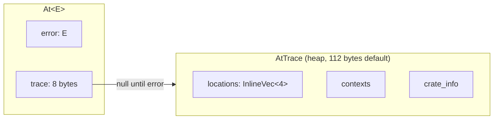

# whereat

[](https://github.com/lilith/whereat/actions/workflows/ci.yml)
[](https://crates.io/crates/whereat)
[](https://docs.rs/whereat)
[](https://codecov.io/gh/lilith/whereat)
[](LICENSE)


Know where the bug is `at()` — **without panic!, debuginfo, or overhead.** Replace `?` with `.at()?` to get build-time, async-friendly stacktraces with clickable GitHub links.

```
Error: UserNotFound
   at src/db.rs:142:9
      ╰─ user_id = 42
   at src/api.rs:89:5
      ╰─ in handle_request
   at myapp @ https://github.com/you/myapp/blob/a1b2c3d/src/main.rs#L23
```

Compatible with `no_std`, plain enums, structs, thiserror, anyhow — any type with `Debug`. No changes to your error types required.

## Quick Start

`at!()` creates a traced error. `.at()?` propagates it. That's it.

```rust
// once in lib.rs — enables clickable GitHub links in traces
// For workspace crates: whereat::define_at_crate_info!(path = "crates/mylib/");
whereat::define_at_crate_info!();

use whereat::prelude::*;

#[derive(Debug)]
enum DbError { NotFound, ConnectionFailed }

fn get_user(id: u64) -> Result<String, At<DbError>> {
    if id == 0 { return Err(at!(DbError::NotFound)); } // at!() starts the trace
    Ok("alice".into())
}

fn get_email(id: u64) -> Result<String, At<DbError>> {
    let name = get_user(id).at()?; // .at()? adds this call site to the trace
    Ok(format!("{}@example.com", name))
}
```

### Multiple error types

```rust
#[derive(Debug)]
enum ApiError { Db(DbError), BadRequest(String) }

fn handle_request(id: u64) -> Result<String, At<ApiError>> {
    let email = get_email(id)
        .at()                           // new frame at this call site
        .at_str("looking up recipient") // context on that frame
        .map_err_at(ApiError::Db)?;     // DbError → ApiError, trace preserved
    Ok(email)
}

fn api_endpoint(id: u64) -> Result<String, At<ApiError>> {
    let result = handle_request(id).at()?; // propagate with location tracking
    Ok(result)
}
```

See [Avoiding Trace Loss](#avoiding-trace-loss) for patterns that silently destroy traces. Full runnable version: [`examples/readme.rs`](examples/readme.rs).

## How it works



`At<E>` is `sizeof(E) + 8` bytes. The trace pointer is null until an error occurs — zero heap allocation on the Ok path. Each `.at()` is `#[track_caller]`, so the compiler bakes file:line:col into the binary as static data. No stack walking, no debug symbols.

### Frames vs contexts

`.at()` creates a **frame** (a new location). `.at_str()` adds **context** to the last frame. Multiple contexts can attach to one frame:

```
   at src/db.rs:15:13           ← .at() created this frame
   at src/db.rs:89:9            ← .at() created this frame
      ╰─ user lookup failed        ╰─ .at_str() added context
   at src/handler.rs:42:5       ← .at() created this frame
      ╰─ processing request        ╰─ .at_str() added context
      ╰─ request_id = 7           ╰─ .at_data() added context
```

**150x faster than `backtrace`**, zero overhead on the Ok path, ~18ns per frame on error. See [PERFORMANCE.md](PERFORMANCE.md) for benchmarks.

## API Reference

### Starting a trace

| Function | Works on | Crate info | Use when |
|----------|----------|------------|----------|
| `at!(err)` | Any type | ✅ GitHub links | Default — requires `define_at_crate_info!()` |
| `at(err)` | Any type | ❌ None | Quick prototyping, no setup |
| `err.start_at()` | `Error` types | ❌ None | Chaining on error values |

### Extending a trace

On `Result<T, At<E>>`:

| Method | Effect |
|--------|--------|
| `.at()` | **New frame** at caller's location |
| `.at_str("msg")` | Static string context on **last frame** (zero-cost) |
| `.at_string(\|\| format!(...))` | Dynamic string context (lazy) |
| `.at_fn(\|\| {})` | New frame + captures function name |
| `.at_named("label")` | New frame + custom label |
| `.at_data(\|\| value)` | Typed context via Display (lazy) |
| `.at_debug(\|\| value)` | Typed context via Debug (lazy) |
| `.at_aside_error(err)` | Attach a related error (diagnostic only, **not** in `.source()` chain) |
| `.map_err_at(\|e\| ...)` | Convert error type, **preserve trace** |

`.at()` creates a NEW frame. `.at_str()` and other context methods add to the LAST frame.

### Inspecting and decomposing

| Method | Effect |
|--------|--------|
| `.error()` | Borrow the inner `&E` |
| `.decompose()` | Consume into `(E, Option<AtTrace>)` — preserves the trace |
| `.map_error(\|e\| ...)` | Convert error type inside `At<E>`, preserving trace |
| `.frame_count()` | Number of location frames in the trace |
| `.full_trace()` | Display formatter showing all frames + contexts |

### Cross-crate tracing

When consuming errors from other crates, use `at_crate!()` to mark the boundary:

```rust
whereat::define_at_crate_info!();

fn call_external() -> Result<(), At<ExternalError>> {
    at_crate!(external_crate::do_thing())?;  // Wraps Result, marks boundary
    Ok(())
}
```

This ensures traces show `myapp @ src/lib.rs:42` instead of confusing paths from dependencies. Desugars to `result.at_crate(crate::at_crate_info())`.

### Hot loops

Don't trace inside hot loops. Defer until you exit:

```rust
fn process_batch(items: &[Item]) -> Result<(), MyError> {
    for item in items {
        process_one(item)?;  // Plain Result here, no At<>
    }
    Ok(())
}

fn caller() -> Result<(), At<MyError>> {
    process_batch(&items)
        .map_err(|e| at!(e).at_skipped_frames())?;  // Wrap on exit, mark skipped
    Ok(())
}
```

## Avoiding Trace Loss

whereat only works if you keep the trace alive as errors propagate. These patterns silently destroy traces — **avoid them**.

### Never use `.into_inner()` during error propagation

`into_inner()` is deprecated since 0.1.4 because it discards the trace. Use `decompose()` to get both error and trace, or `map_error()` / `map_err_at()` to convert types while preserving the trace.

```rust
// WRONG — trace is gone
let bare_err = at_err.into_inner();
return Err(at(MyError::Sub(bare_err)));

// RIGHT — trace preserved
return inner_call().map_err_at(|e| MyError::Sub(e));
```

### Never implement `From<At<X>> for Y`

This gets invoked by `?` and discards the `At<>` wrapper (and its trace):

```rust
// WRONG — ? uses this From impl, trace dies
impl From<At<BufferError>> for TiffError {
    fn from(e: At<BufferError>) -> Self {
        TiffError::Buffer(e.into_inner())  // trace lost!
    }
}

// RIGHT — implement From on the bare types, convert with map_err_at
impl From<BufferError> for TiffError {
    fn from(e: BufferError) -> Self { TiffError::Buffer(e) }
}

fn decode() -> Result<(), At<TiffError>> {
    pixel_call().map_err_at(TiffError::from)?;  // trace preserved
    Ok(())
}
```

### Never format-then-rewrap

```rust
// WRONG — inner trace is gone, you only get the adapter's location
.map_err(|e| Error::Other(format!("decode failed: {}", e.into_inner())).at())?;

// RIGHT — convert the error type, keep the trace
.map_err_at(|e| Error::Other(e.to_string()))?;
```

### `#[from]` doesn't work with `At<>` — don't reach for `.into_inner()`

thiserror's `#[from]` generates `From<SubError> for MyError`, but `?` on `Result<T, At<SubError>>` needs `From<At<SubError>> for At<MyError>`, which doesn't exist. The compiler will reject it. The temptation is to "fix" this with `.into_inner()` — **don't**. Use `map_err_at` instead:

```rust
// WON'T COMPILE — no From<At<SubError>> for At<MyError>
sub_call()?;

// WRONG — compiles but trace dies
sub_call().map_err(|e| MyError::Sub(e.into_inner()))?;

// RIGHT — trace preserved
sub_call().map_err_at(|e| MyError::Sub(e))?;
```

### Always trace at error origination

Every `Err(MyError::Variant)` should be `Err(at(MyError::Variant))` or `Err(at!(MyError::Variant))`. If you skip this, there's no trace to propagate.

## Design

**You define your own error types.** whereat wraps them in `At<E>` to add location + context + crate tracking. Works with plain enums, structs, thiserror, anyhow — anything with `Debug`.

| Situation | Use |
|-----------|-----|
| Existing struct/enum you don't want to modify | Wrap with `At<YourError>` |
| Want traces embedded inside your error type | Implement [`AtTraceable`](ADVANCED.md#embedded-traces-attraceable) |

`At<E>` is `no_std` (`core` + `alloc`). The `std` feature exists for historical compatibility but is a no-op — `core::error::Error` is stable since Rust 1.81.

See also: [Inline storage features](ADVANCED.md#allocation-behavior) | [Workspace layouts](ADVANCED.md#complex-workspace-layouts) | [Link format customization](ADVANCED.md#link-formats) | [Pretty output](ADVANCED.md#pretty-output-formatters)

## License

MIT OR Apache-2.0
